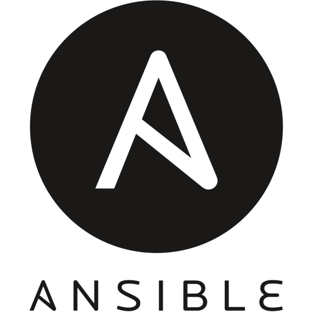
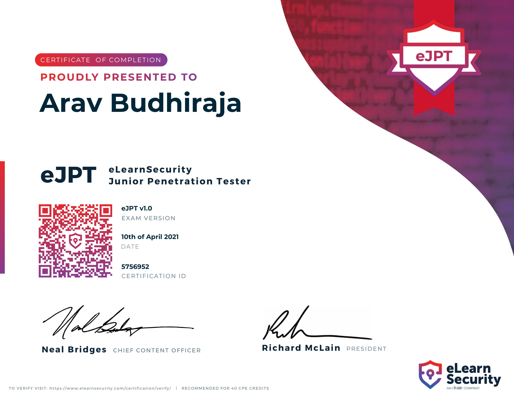

# print("Hello World!")
## I'm Arav Budhiraja, an Ethical Hacker and Pythonista

👦‣15 year old from India  
📚‣Currently learning data science 
💻‣2021 Goals: Contribute to Open-Source Projects  
🌐‣My Website: https://arav06.github.io/

 
### Skills
[][a]
[][a]
[][a]
[][a]
[][a]
[][a]
[][a]
[][a]
[][a]
[][a]

 
 
 
 

 
 

### Certs

 
 
 

### Get in touch

 
 

### Github Stats

***
[a]:#
 
 
 
