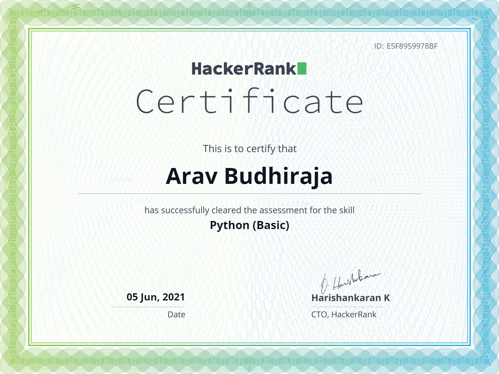

# print("Hello World!")
## I'm Arav Budhiraja, an Ethical Hacker and Pythonista

👦‣15 year old from India  
📚‣Currently learning data science  
💻‣2021 Goals: Contribute to Open-Source Projects  
🌐‣My Website: https://arav06.github.io/
 

### Skills

[][a]
[][a]
[][a]
[][a]
[][a]
[][a]
[][a]
[][a]
[][a]
[][a]

 
 
 
 

 
 

### Certs

 &nbsp;&nbsp;&nbsp;&nbsp;
 &nbsp;&nbsp;&nbsp;&nbsp;

 
 
 

### Get in touch

[][m]
[][i]
[][f]

 
 
 
 
 

### Github Stats

***

[a]:#
[m]:mailto:contact.arav06@gmail.com
[i]:https://instagram.com/arav.06
[f]:https://www.fiverr.com/arxvv_
 
 
